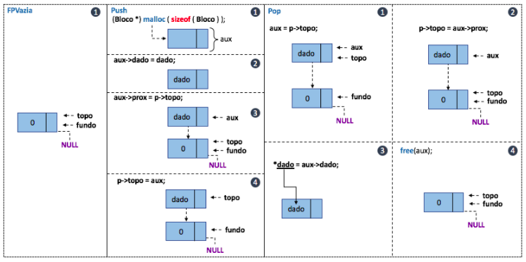

# Pilhas Dinâmicas: Implementação em C

 
 
 
 

 

 

Para o desenvolvimento de um tipo pilha dinânico, precisamos reservar memória para alocar nossos blocos de dados. Além disso, precisamos criar um bloco chamado "cabeça" para que nossos apontadores possam existir e manipular corretamente as regras da estrutura que estamos tratando.

Na pilha, é preciso definir apontadores para <b>fundo</b> e <b>topo</b> e esses são tratados da mesma forma que os ponteiros primeiro e ultimo de uma lista dinâmica [vide git](https://github.com/mpiress/dynamic_list). Também segue as mesmas regras de inserção e remoção de sua estrutura estática [vide git](https://github.com/mpiress/linear_stack). Vejamos uma representação gráfica da pilha dinâmico e como se comportam os blocos armazenados na memória.

	 

Em linhas gerais, a estrutura pilha é muito semelhante a uma lista dinâmica, exceto por inverter a forma como os ponteiros de inicialização são manipulados. Uma vez que, a pilha tem como regra o último que entra é o primeiro a sair, (do inglês, Last In First Out - LIFO), a lógica de manipulação dos ponteiros deve ser modificada para se adaptar a essa regra. Dessa forma,  um novo bloco é inserido utilizando o ponteiro de topo e esse novo bloco apontará para o último já inserido. Note que, ao contrário de fazer o ponteiro de topo (ou último em lista) apontar para o próximo, faz-se o ponteiro de próximo do novo bloco apontar para o topo e só depois atualizaremos o topo para a posição de memória do novo bloco. Vejamos a representação das funções de inicialização (FPVazia), inserção (Push) e remoção (Pop) de uma pilha dinâmica.

	 

# Compilação e Execução

A pilha dinâmica disponibilizada possui um arquivo Makefile que realiza todo o procedimento de compilação e execução. Para tanto, temos as seguintes diretrizes de execução:

| Comando                |  Função                                                                                           |                     
| -----------------------| ------------------------------------------------------------------------------------------------- |
|  `make clean`          | Apaga a última compilação realizada contida na pasta build                                        |
|  `make`                | Executa a compilação do programa utilizando o gcc, e o resultado vai para a pasta build           |
|  `make run`            | Executa o programa da pasta build após a realização da compilação                                 |

# Contatos

 

<a style="color:black" href="mailto:michel@cefetmg.br?subject=[GitHub]%20Source%20Dynamic%20Lists">
✉️ <i>michel@cefetmg.br</i>
</a>
